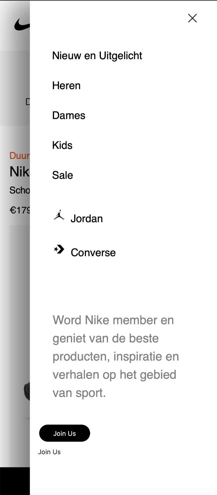

# Procesverslag
Markdown is een simpele manier om HTML te schrijven.  
Markdown cheat cheet: [Hulp bij het schrijven van Markdown](https://github.com/adam-p/markdown-here/wiki/Markdown-Cheatsheet).

Nb. De standaardstructuur en de spartaanse opmaak van de README.md zijn helemaal prima. Het gaat om de inhoud van je procesverslag. Besteedt de tijd voor pracht en praal aan je website.

Nb. Door *open* toe te voegen aan een *details* element kun je deze standaard open zetten. Fijn om dat steeds voor de relevante stuk(ken) te doen.

## Jij

  
uitwerken voor kick-off werkgroep

  ### Auteur:
  Ayesha Ashruf

  #### Je startniveau:
  Rood.

  #### Je focus:
  Mijn focus ligt op de surface plane.
 

## Je website

  
uitwerken voor kick-off werkgroep

  ### Je opdracht:
  <a>https://www.nike.com/nl/</a>
  <a>https://www.nike.com/nl/t/air-max-dn-se-schoenen-4PdLm8/HM0810-401</a>

  #### Screenshot(s) van de eerste pagina (small screen): 
  Home  
  

  #### Screenshot(s) van de tweede pagina (small screen):
  Detail pagina van de Nike Air Max Dn SE  
  
 

Het is de bedoeling dat ik de home pagina en de gekozen detail pagina uit zal werken.

## Toegankelijkheidstest 1/2 (week 1)

  
uitwerken na test in 2e werkgroep

  ### Bevindingen
  Lijst met je bevindingen die in de test naar voren kwamen:

  Tijdens de werkgroep van donderdag 5 september heb ik de nike website getest     met de voice over      functie van macOS hieruit zijn de volgende bevindingen         uitgekomen:  

Voice over slaat veel dingen over. De voice over benoemt de header, zoekbalk     etc. Verder verteld de voice over dat er een filmpje wordt afgespeeld (dat tevens ook de hero is van de pagina) en dat het filmpje zich in een groep bevindt en dat je een bepaalde shortcut moet invoeren wil je het filmpje kunnen bedienen; pauzeren, dempen, verder skippen etc. Wanneer je je buiten de groep bevindt skipt de voice over meteen door naar de eerst volgende product card rij, oftewel de articles. De hero die volgt na de main hero wordt volledig over geslagen. Na het benoemen van de eerste product card rij of articles, skipt de voice over meteen door naar de footer. 

Na deze bevindingen heb ik de WCAG checklist getest, echter zijn de resultaten niet vergelijkbaar met de slechte accesibility van de voice over test. Mijn resultaten zijn meer ja dan nee en ook die van mijn 2e test persoon.

Daardoor heb ik besloten om verder onderzoek te doen over hoe accessible de nike website werkelijk is. 

Het had werkelijk 1 google search nodig en de artikelen over Nike.com kwamen al naar boven.
Nike heeft dus blijkbaar een zeer slechte interface als het gaat over accessibility. Lees hieronder waarom: <a> https://silktide.com/blog/nike-faces-web-accessibility-lawsuit/"</a>

Ik kan hieruit concluderen dat de website van nike nog erg veel werk te verrichten heeft.   

## Breakdownschets (week 1)

  
uitwerken na afloop 3e werkgroep

  ### de hele pagina: 
  

  ### dynamisch deel (bijv menu): 
  

## Voortgang 1 (week 2)

  
uitwerken voor 1e voortgang

  ### Stand van zaken
  hier dit ging goed & dit was lastig (neem ook screenshots op van delen van je website en code)

  ### Agenda voor meeting
  samen met je groepje opstellen

  nvt.

 

  ### Verslag van meeting
   Om eerlijk te zijn hebben mijn groepje en ik geen agenda opgesteld betreft de eerste voortgang. We hebben tijdens de meeting    wel met elkaar overlegd over hamburger menu's en layouts. Verder hebben de studentassistenten goed advies en feedback kunnen    geven.

  - We hebben gevraagd of je echt gebruik moet maken van javascript en het antwoord was ja.

Mijn voortgang voor de website zag er toen zo uit:  
 
en toen zo:  

    

## Voortgang 2 (week 3)

  
uitwerken voor 2e voortgang

  ### Stand van zaken
  
Thuis heb ik wel in een tempo doorgewerkt. Ik heb een eigen font ingeladen die ik persoonlijk al in bezit heb genaamd Futura. Nike gebruikt voor de headings Futura maar dan een speciale variant alleen voor hen. Daarnaasr gebruiken zij HelveticaNow voor de rest. Nu is het zo dat ik Helvetica en Helvetica Neue in mijn bezit heb. Ik heb daarom ook (net als hoe ik Futura heb ingeladen) ook geprobeerd om Helvetica in te laden. 

Helaas is niet niet gelukt. Ik weet toevallig dat je bepaalde fonts die je lokaal vanaf een eigen server of pc/laptop etc wilt inladen het soms niet lukt omdat het niet een "web safe font" is. Dit was dus zo een geval. 

Net als hoe ik mijn Futura bestand heb omgezet in een @font-face kit heb ik dat ook gedaan voor Helvetica. Dit lukte echter niet omdat het Helvetica bestand een .ttc bestand is. Futura heb ik wel kunnen omzetten in .otf, .woff en .woff2.

Dit heb ik gedaan met een tool genaamd web font generator van Font Squirrel.
<a>https://www.fontsquirrel.com/tools/webfont-generator</a>

De voortgang ziet voor deze week zo uit:  
  

Zoals je kan zien, werkt de hero foto niet helemaal als ik zou willen. De bedoeling is namelijk dat de tekst op de foto komt en de foto zich uitrekt over de volledigheid van de div.

Voor nu is het denk ik belangrijk dat ik verder ga met de layout zodat ik later kan focussen op het fixen van de hero. Ik ben er later achter gekomen dat het eigenlijk geen hero is maar een product card, maar omdat het aan het begin van de pagina is gepositioneerd dient het ook als een hero.

  ### Agenda voor meeting
  samen met je groepje opstellen

  nvt.

  ### Verslag van meeting

  Helaas kon ik niet aanwezig zijn voor de 2e voortgang wegens gezondheids redenen. 

## Toegankelijkheidstest 2/2 (week 4)

  
uitwerken na test in 9e werkgroep

  ### Bevindingen
 In de toegankelijkheids test voor mijn eigen website is het volgende naar boven gekomen:
 

## Voortgang 3 (week 4)

  
uitwerken voor 3e voortgang

  ### Stand van zaken
  Bij de laatste voortgang heb ik met Danny gekeken naar de SVG's van Nike en hoe ik die kan toepassen op mijn eigen site en hoe ik die kan opslaan. Een van de student assistentes heeft ook geprobeerd om te helpen maar met Danny kwam ik er al snel uit. 

  ### Verslag van meeting
  hier na afloop snel de uitkomsten van de meeting vastleggen

  - Danny vermelde dat ik nog best veel werk te doen heb maar door de omstandigheden waar ik me in bevond zei hij dat ik alleen moet doen wat ik kan.
  - Verder zag het er allemaal prima uit.

zelf heb ik veel gedaan in deze week; Ik heb voor de home page nog wat extra dingetjes moeten doen zoals een collapsible menu maken voor in de footer. Daarnaast ben ik begonnen aan de 2e pagina. Wat aan de late kant maar alas. Het gaat erom dat ik zo goed mogelijk de opdracht kan afronden. 

## Eindgesprek (week 5)

  
uitwerken voor eindgesprek

  ### Je uitkomst - karakteristiek screenshots:
    
  voor de detail pagina zijn er veel dingen gelukt maar ook een aantal dingen niet. Zo heb ik bijvoorbeeld niet de pijltjes die nike heeft niet kunnen implementeren en is het toevoegen van de pijltjes onderaan de collapsible niet gelukt. Ook is het niet gelukt om de tekst in de cards onderaan de index te krijgen voor de memberships.

  
    
     
    
   
   
   
  

  ### Dit ging goed/Heb ik geleerd: 
  Korte omschrijving met plaatjes

  Met het overal plaatje ben ik zeer tevreden over hoe alles eruit is komen te zien.

  
   

  ### Dit was lastig/Is niet gelukt:
  Korte omschrijving met plaatjes

  
   
    
  
  
  
  

## Bronnenlijst

  
continu bijhouden terwijl je werkt

  1. ChatGPT | text overlay on image. (z.d.). chatgpt.com. Geraadpleegd op 22 september 2024, van https://chatgpt.com/share/66f0b86e-86d4-800e-b4e8-315dd28ecdf9 (aanpassingen gemaakt)
  2.ChatGPT | Collapsible menu. (z.d.). Chatgpt. Geraadpleegd op 23 september 2024, van https://chatgpt.com/c/66f187b2-b63c-800e-80c3-e95cce6ee009
  3. Font displaying issues, SVG nav & menu links not showing | ChatGPT | (z.d) Chatgpt. Geraadpleegd op 28 september 2024, van https://chatgpt.com/c/66f811ef-c174-800e-a122-314b52acb17b
  4. nike (Netherlands) | afbeeldingen. (z.d.). Nike.com. https://www.nike.com/nl/
  5.  W3Schools online HTML editor. (z.d.). Geraadpleegd op 23 september 2024, van https://www.w3schools.com/howto/tryit.asp?filename=tryhow_js_collapsible_symbol
     

